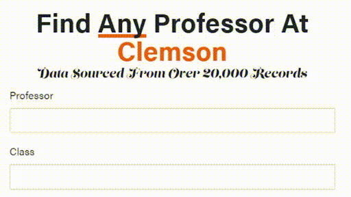

<p align="center">
  <b>Grade Distributions for Clemson University Professors</b>
</p>


## Overview
Professor Search provides in-depth information about professors and courses at Clemson University, including grade distributions and research statistics. The site was built using the Angular web framework, with visualizations in d3.js.


<br>
<p align="left">
  
</p>

## Data
Data was collected from [Clemson's Grade Distribution Reports](https://www.clemson.edu/institutional-effectiveness/oir/GDR.html) and [Scopus](https://www.scopus.com/home.uri) using a Python Scraper (not included in the repository).

**Example Data**
```
  {
    "ID": 0,
    "Professor": "Albus Dumbledore",
    "Subject": "WZD",
    "Cuid": "MUGGLE",
    "A": 80,
    "B": 10,
    "C": 5,
    "D": 0,
    "F": 5,
    "W": 0,
    "H-Index": "20000",
    "Courses": [
      0
    ],
    "Years Taught": [
      1881
    ],
    "Title": "Professor",
    "Affiliation": "employee",
    "Department": "Hogwarts"
  }
```


## Contributing
If you find an issue or believe a feature should be added, please reach out and I will look into it. If you
are a current student, you can help keep the site up to date by sending a copy of the latest grade distribution
report.
